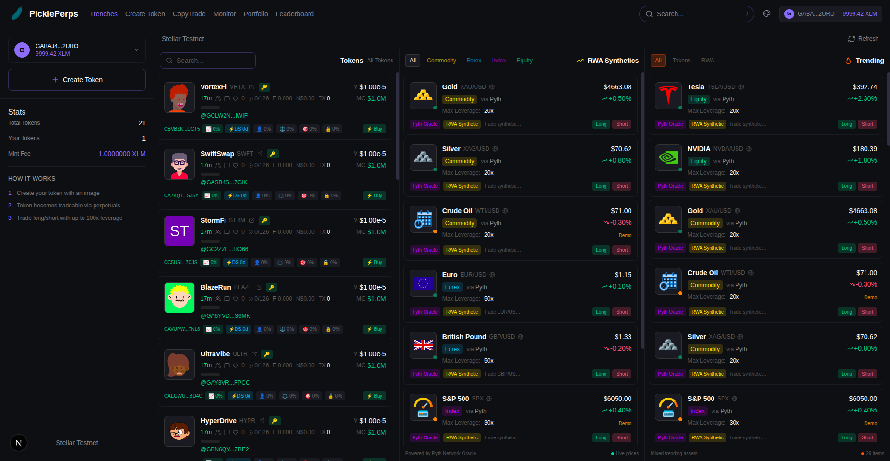

# PicklePerps

A high-speed perpetual trading platform for tokens and real-world assets on Stellar Network.



## Why PicklePerps

Most DEXs are slow. Heavy frontends, laggy charts, delayed execution. By the time your trade goes through, the price has moved.

PicklePerps fixes that. Fast execution, real-time charts. You can wait 2 seconds to cross the road - but not when you're trading perps.

## Screenshots

| Token Trading | Token Creation |
|:---:|:---:|
|  |  |

| Portfolio | System Monitor |
|:---:|:---:|
|  |  |

## Features

### Token Platform
- **Create Tokens** - Launch tokens with IPFS image storage and customizable creator allocation (1-10%)
- **Bonding Curve Trading** - Automatic market-making with linear price curves, no liquidity bootstrapping needed
- **Real-time Charts** - Live candlestick charts updating as trades happen

### Perpetual Trading
- **Up to 100x Leverage** - Trade long/short positions on any token
- **Real-time PnL** - Live profit/loss tracking with liquidation warnings
- **Price Feeds** - Bonding curve prices with Pyth Oracle fallback

### RWA Synthetic Assets
Trade real-world assets on-chain with leverage. No KYC, no brokers.

| Category | Assets |
|----------|--------|
| Commodities | Gold (XAU), Silver (XAG), Crude Oil (WTI) |
| Forex | EUR/USD, GBP/USD, JPY/USD |
| Equities | Apple, Tesla, NVIDIA |
| Crypto | BTC, ETH, SOL |
| Indices | S&P 500 |

All prices powered by Pyth Network - institutional-grade oracles with sub-second updates.

### Copy Trading
- **Leaderboard** - Rankings by PnL, win rate, and volume
- **Follow Leaders** - Subscribe with your capital, positions copy proportionally
- **On-chain Execution** - Smart contracts handle everything, no trust required

## The Math

### Bonding Curve
```
price = initialPrice + (coefficient * soldTokens / totalSupply)
```
- Initial Price: $0.00001
- Price doubles when 100% of curve tokens sold
- Trading Fee: 0.5%

### Perpetual PnL
```
PnL = positionSize * leverage * (currentPrice - entryPrice) / entryPrice
```
- Liquidation occurs when margin is depleted
- Max leverage: 100x (tokens), 50x (forex), 20x (commodities)

## Network

| Property | Value |
|----------|-------|
| Network | Stellar Testnet |
| RPC | https://soroban-testnet.stellar.org |
| Horizon | https://horizon-testnet.stellar.org |
| Explorer | https://stellar.expert/explorer/testnet |
| Currency | XLM |

## Contract Addresses (Soroban)

| Contract | Address |
|----------|---------|
| TokenFactory | `CBE2O7ZNTL5YYDWA2DERTZZGLD2Y26DZPBS4UQG3AFKAKAHAYS7CIBC2` |
| BondingCurve | `CAYFHHMOOUKN3TR7OUPNDA7HDVFURQY4BYB2UYWP3JSEHZXGKVTTU36E` |
| PerpetualTrading | `CCPRQDXBRZYXNPLXAOEMXABMN6KCRRGNLL7FBRYNTKS576PEB35QXME5` |
| PikeToken | `CBBLCH7N4QPAQZPSOOD3ECCV4UPFEGIUEEVSDWZA5OX6MDNJ5PE7S476` |

See [CONTRACTS.md](CONTRACTS.md) for full details and explorer links.

## Getting Started

### Prerequisites
- Node.js 18+
- Freighter Wallet (Stellar)
- Stellar Testnet XLM tokens

### Web App Installation

```bash
# Install dependencies
npm install

# Set environment variables
cp .env.example .env.local
# Edit .env.local with your values

# Run development server
npm run dev
```

Open https://pickle-perps.vercel.app

## Tech Stack

| Layer | Technology |
|-------|------------|
| Frontend | Next.js 15, React 19, TypeScript |
| Styling | Tailwind CSS, shadcn/ui |
| Web3 | @stellar/stellar-sdk, @stellar/freighter-api |
| State | Zustand, TanStack Query |
| Blockchain | Stellar Network (Soroban) |
| Storage | IPFS via Pinata |

## Project Structure

```
PicklePerps/
├── app/                    # Next.js app directory
├── components/             # React components
├── contracts-stellar/      # Soroban smart contracts (Rust)
│   ├── pike_token/
│   ├── token_factory/
│   ├── bonding_curve/
│   └── perpetual_trading/
├── hooks/                  # React hooks
├── lib/                    # Utilities
└── subgraph/               # GraphQL indexing
```

## Environment Variables

```env
# Stellar
NEXT_PUBLIC_STELLAR_RPC_URL=https://soroban-testnet.stellar.org
NEXT_PUBLIC_STELLAR_HORIZON_URL=https://horizon-testnet.stellar.org

# IPFS
NEXT_PUBLIC_PINATA_JWT=your_pinata_jwt
```

## Development

### Smart Contracts (Soroban)
```bash
cd contracts-stellar

# Build all contracts
stellar contract build

# Deploy (uses deploy.sh)
bash deploy.sh
```

## Links

- **Web App**: https://pickle-perps.vercel.app
- **GitHub**: https://github.com/Sadhana7836/picklePerps
- **Feedback Form**: https://docs.google.com/forms/d/e/1FAIpQLSeNZcu_mW7E3GTQF9nSORIMpUHx1KgjYbg2IHzLG_nIdhNUmg/viewform?usp=header
- **Feedback Sheet**: https://docs.google.com/spreadsheets/d/1bwbo3vrIWtCngE36T7HYHfTFdtFy9lqeP0Q-CIAynr8/edit?usp=sharing
